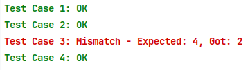

Ce projet est conçu pour aider les étudiants à résoudre de manière autonome sept problèmes distincts, chacun avec un ensemble d'entrées, des résultats attendus et des exigences de solution spécifiques. Les problèmes sont structurés de manière à permettre aux étudiants de se concentrer sur chaque problème individuellement, sans aucune dépendance entre eux. Chaque problème, désigné par `exerciceX`, dispose de son propre dossier contenant les fichiers nécessaires, comme indiqué ci-dessous.

### Structure du Projet

Chaque exercice suit une structure de répertoire standardisée :

```
exerciceX
|________input.txt
|________expected.txt
|________exerciceX.c
```

Voici une description détaillée de l’utilité de chaque fichier :

- **`input.txt`** : Contient les données d'entrée nécessaires pour le problème, généralement formatées pour accueillir plusieurs cas de test. Chaque ligne ou ensemble de lignes de ce fichier représente un cas de test distinct que votre solution doit traiter.

- **`expected.txt`** : Contient les résultats attendus pour chaque cas de test dans `input.txt`. Votre solution doit comparer les résultats générés avec ces résultats attendus pour valider la correction.

- **`exerciceX.c`** : C'est le fichier source en C où vous écrirez le code de solution pour le Problème X. Il doit contenir la logique pour lire les entrées depuis `input.txt`, les traiter selon les exigences du problème, puis comparer les résultats obtenus avec ceux attendus dans `expected.txt`. Si le résultat de la solution correspond au résultat attendu, un message "Succès" en vert devrait apparaître dans la console. En cas de divergence, un message "Échec" en rouge devrait s'afficher.

### Implémentation de la Solution

Pour chaque problème, suivez ces étapes pour implémenter votre solution :

1. **Lire les Données d'Entrée** : Commencez par ouvrir `input.txt` et lisez les données de cas de test. Analysez ces données selon le format spécifié dans chaque description de problème.

2. **Traiter le Cas de Test** : Écrivez le code nécessaire pour résoudre le problème en utilisant les données d'entrée analysées. Assurez-vous que votre solution respecte les exigences du problème (par exemple, effectuer certains calculs, implémenter des algorithmes ou manipuler des structures de données comme des graphes ou des tableaux).

3. **Comparer les Résultats** :
    - Exécutez votre solution pour chaque cas de test et stockez le résultat généré.
    - Ouvrez `expected.txt` et lisez les résultats attendus correspondants pour chaque cas de test.
    - Comparez le résultat de votre solution avec le résultat attendu.

4. **Afficher les Résultats** :
    - Si le résultat de la solution correspond au résultat attendu pour un cas de test, affichez un message "Cas de Test Réussi" en vert pour indiquer le succès.
    - En cas de divergence, affichez un message "Cas de Test Échoué" en rouge, incluant des détails tels que le numéro du cas de test, le résultat attendu et le résultat obtenu pour faciliter le débogage.

### Exemple de Sortie de Console

Voici un exemple de ce à quoi pourrait ressembler la sortie de console lors de l'exécution d'une solution correcte :



## Problème 1

On vous donne une chaîne de caractères `s` composée des caractères `(`, `)`, `{`, `}`, `[` et `]`. Une séquence de parenthèses est considérée comme équilibrée si :

1. Chaque parenthèse ouvrante a une parenthèse fermante correspondante du même type.
2. Les parenthèses sont fermées dans le bon ordre.

Par exemple, les chaînes `()`, `[]`, `{}`, `({[]})` et `[{()}]` sont équilibrées, tandis que `([)]`, `(()` et `[[{]}` ne le sont pas.

Votre tâche est de déterminer si la chaîne donnée `s` est équilibrée. Si elle est équilibrée, affichez "YES". Sinon, affichez "NO".

#### Entrée :

- Une ligne contenant la chaîne `s` (1 ≤ |s| ≤ 100 000).

#### Sortie :

- Affichez "YES" si la chaîne est équilibrée, sinon affichez "NO".

#### Exemples :

**Entrée :**
```
{[()]}
```

**Sortie :**
```
YES
```

**Entrée :**
```
{[(])}
```

**Sortie :**
```
NO
```

**Entrée :**
```
{{[[(())]]}}
```

**Sortie :**
```
YES
```

**Entrée :**
```
((()))
```

**Sortie :**
```
YES
```

**Entrée :**
```
(((((
```

**Sortie :**
```
NO
```

#### Contraintes :

- La chaîne ne contiendra que les caractères `(`, `)`, `{`, `}`, `[` et `]`.


## Problème 2

On vous donne un tableau d'entiers `a` de taille `n`. Votre tâche est de trouver la somme maximale d'un sous-tableau contigu de `a` tel que :

1. La somme du sous-tableau soit inférieure ou égale à un entier donné `k`.
2. Le sous-tableau doit contenir au moins un élément.

Écrivez une fonction pour déterminer cette somme maximale.

#### Entrée :

- La première ligne contient deux entiers, `n` (1 ≤ n ≤ 100 000) et `k` (1 ≤ k ≤ 1 000 000).
- La deuxième ligne contient `n` entiers `a[i]` (−1 000 000 ≤ a[i] ≤ 1 000 000).

#### Sortie :

- Affichez la somme maximale du sous-tableau contigu qui satisfait les conditions. S'il n'existe aucun sous-tableau répondant aux critères, affichez `0`.

#### Exemples :

**Entrée :**
```
5 7
1 -2 3 4 -1
```

**Sortie :**
```
7
```

**Entrée :**
```
4 3
5 -1 2 -2
```

**Sortie :**
```
3
```

**Entrée :**
```
3 0
1 2 3
```

**Sortie :**
```
0
```

#### Contraintes :

- La somme du sous-tableau ne doit pas dépasser `k`.
- La taille du tableau `n` peut être grande, donc une solution efficace est nécessaire.


## Problème 3
Samir et Bob sont de proches amis. Bob, avec son grand sens de l'humour, a mis Samir au défi de résoudre un problème différent de celui du plus long chemin.

On vous donne deux entiers, \( l \) et \( r \). Pour chaque entier de \( l \) à \( r \) (inclus), listez tous ses diviseurs entiers sauf 1. Votre tâche est de trouver l’entier qui apparaît le plus fréquemment parmi ces diviseurs.

Veuillez démontrer que ce problème n'est pas NP-complet.

#### Entrée
La première ligne contient deux entiers \( l \) et \( r \) (avec \( 2 \leq l \leq r \leq 10^9 \)).

#### Sortie
Affichez un seul entier qui apparaît le plus dans la liste des diviseurs. S'il y a plusieurs entiers avec la même fréquence maximale, n'importe lequel d'entre eux suffira.

#### Exemples
**Entrée :**
```
19 29
```
**Sortie :**
```
2
```

**Entrée :**
```
3 6
```
**Sortie :**
```
3
```

#### Remarque
Pour rappel, un diviseur d'un entier est défini comme tout entier qui divise le nombre sans laisser de reste.

**Explication des exemples :**
- Dans le premier exemple, les entiers de 19 à 29 qui sont divisibles par 2 sont : {20, 22, 24, 26, 28}.
- Dans le second exemple, les entiers de 3 à 6 qui sont divisibles par 3 sont : {3, 6}.

## Problème 4

Samir est un fan de programmation compétitive et suit de près les concours impliquant son programmeur préféré. Bien que Samir ne sache pas lui-même écrire de programmes, il aime suivre les performances de son programmeur favori lors des concours.

Samir a enregistré les scores que son programmeur préféré a obtenus lors de chaque concours, dans l'ordre chronologique. Il définit une performance comme "incroyable" dans deux cas :
1. Lorsque le programmeur obtient un score strictement supérieur à tous les scores précédents, battant ainsi son record de score le plus élevé.
2. Lorsque le programmeur obtient un score strictement inférieur à tous les scores précédents, battant ainsi son record de score le plus bas.

Le premier concours n'est pas considéré comme incroyable, quel que soit le score. Samir souhaite connaître le nombre de performances incroyables réalisées par son programmeur préféré au cours de tous les concours.

#### Entrée

- La première ligne contient un entier \( n \) (1 ≤ \( n \) ≤ 1000) — le nombre de concours.
- La deuxième ligne contient \( n \) entiers séparés par des espaces représentant les scores obtenus par le programmeur lors de chaque concours. Chaque score ne dépasse pas 10 000.

#### Sortie

- Affichez un seul entier — le nombre total de performances incroyables enregistrées.

#### Exemple

**Entrée :**
```
5
100 50 200 150 200
```

**Sortie :**
```
2
```

**Explication :**
Les performances incroyables ont eu lieu lors des concours 2 et 3.

**Entrée :**
```
10
4664 6496 5814 7010 5762 5736 6944 4850 3698 7242
```

**Sortie :**
```
4
```

**Explication :**
Les performances incroyables ont eu lieu lors des concours 2, 4, 9 et 10.


## Problème 5

Le département de police de votre ville est en phase de démarrage et manque actuellement de personnel. Pour y remédier, ils recrutent de nouveaux agents en groupes.

Cependant, des crimes se produisent continuellement dans la ville. Chaque agent de police ne peut traiter qu'un seul crime au cours de sa carrière.

Si un crime se produit alors qu'aucun agent n'est disponible (c'est-à-dire que tous sont occupés), ce crime restera non traité.

Étant donné une séquence d'événements, qui inclut à la fois des crimes et des recrutements d'agents, déterminez combien de crimes restent non traités.

#### Entrée

- La première ligne contient un entier \( n \) (1 ≤ \( n \) ≤ \( 10^5 \)), le nombre total d'événements.
- La deuxième ligne contient \( n \) entiers séparés par des espaces.
    - Si l'entier est -1, cela signifie qu'un crime s'est produit.
    - Si l'entier est un nombre positif, cela indique qu'un certain nombre d'agents ont été recrutés à ce moment-là (pas plus de 10 agents peuvent être recrutés lors d'un seul événement).

#### Sortie

- Affichez un seul entier représentant le nombre de crimes qui n'ont pas été traités.

#### Exemples

**Entrée 1 :**
```
3
-1 -1 1
```
**Sortie 1 :**
```
2
```

**Entrée 2 :**
```
8
1 -1 1 -1 -1 1 1 1
```
**Sortie 2 :**
```
1
```

**Entrée 3 :**
```
11
-1 -1 2 -1 -1 -1 -1 -1 -1 -1 -1
```
**Sortie 3 :**
```
8
```

#### Explication de l'Exemple 2 :

1. Un agent est recruté (1 agent disponible).
2. Un crime se produit ; l'agent disponible s'en charge.
3. Un autre agent est recruté (2 agents disponibles).
4. Un crime se produit ; le dernier agent recruté s'en charge.
5. Un crime se produit ; aucun agent n'est disponible, donc ce crime reste non traité.
6. Trois agents sont recrutés (5 agents au total disponibles).
7. Le processus continue, résultant en 1 crime non traité.


## Problème 6

Le plus grand commun diviseur (PGCD) de deux entiers positifs \( a \) et \( b \) est défini comme le plus grand entier \( d \) qui divise à la fois \( a \) et \( b \) sans laisser de reste. Il existe des méthodes efficaces pour calculer le PGCD, telles que l'algorithme d'Euclide.

Dans ce problème, cependant, vous devez trouver le plus grand entier \( d \) tel que chaque entier dans la plage de \( a \) à \( b \) (inclus) soit divisible par \( d \). Les valeurs de \( a \) et \( b \) peuvent être extrêmement grandes, jusqu'à \( 10^{100} \), ce qui signifie qu'elles ne peuvent pas être représentées même dans un type d'entier de 64 bits.

#### Entrée

- L'entrée se compose d'une seule ligne contenant deux entiers \( a \) et \( b \) (où \( 1 \leq a \leq b \leq 10^{100} \)).

#### Sortie

- Affichez un seul entier : le plus grand commun diviseur de tous les entiers de \( a \) à \( b \) inclusivement.

#### Exemples

**Entrée 1 :**
```
1 2
```
**Sortie 1 :**
```
1
```

**Entrée 2 :**
```
61803398874989484820458683436563811772030917980576 61803398874989484820458683436563811772030917980576
```
**Sortie 2 :**
```
61803398874989484820458683436563811772030917980576
```

#### Explication

Dans le premier exemple, les nombres 1 et 2 ont un PGCD de 1, car aucun entier supérieur à 1 ne divise les deux. Dans le second exemple, comme \( a \) et \( b \) sont identiques, le PGCD est le nombre lui-même.


## Problème 7

Étant donné un graphe dirigé représenté sous forme de liste d'adjacence, votre tâche est de déterminer s'il y a des boucles (cycles) dans le graphe. Une boucle (ou cycle) est un chemin qui commence et se termine au même sommet sans retracer d'arête.

**Entrée :**

- La première ligne contient un entier \( n \) (1 ≤ \( n \) ≤ 10^4), le nombre de sommets dans le graphe.
- La deuxième ligne contient un entier \( m \) (0 ≤ \( m \) ≤ 10^5), le nombre d'arêtes dirigées dans le graphe.
- Les \( m \) lignes suivantes contiennent chacune deux entiers \( u \) et \( v \) (1 ≤ \( u, v \) ≤ \( n \)), représentant une arête dirigée du sommet \( u \) au sommet \( v \).

**Sortie :**

- Affichez "YES" si le graphe contient au moins une boucle, et "NO" sinon.

#### Cas de Test 1 :
**Entrée :**
```
3
3
1 2
2 3
3 1
```
**Sortie :**
```
YES
```

#### Cas de Test 2 :
**Entrée :**
```
4
4
1 2
2 3
3 4
4 5
```
**Sortie :**
```
NO
```

#### Cas de Test 3 :
**Entrée :**
```
5
6
1 2
2 3
3 1
4 5
5 4
5 1
```
**Sortie :**
```
YES
```

#### Cas de Test 4 :
**Entrée :**
```
6
0
```
**Sortie :**
```
NO
```

#### Cas de Test 5 :
**Entrée :**
```
5
5
1 2
2 3
3 4
4 5
5 2
```
**Sortie :**
```
YES
```

### Explication :

- Dans **le Cas de Test 1**, il y a un cycle 1 → 2 → 3 → 1.
- Dans **le Cas de Test 2**, il n'y a pas de cycles car toutes les arêtes mènent loin des sommets de départ.
- Dans **le Cas de Test 3**, deux cycles existent : 1 → 2 → 3 → 1 et 4 → 5 → 4.
- Dans **le Cas de Test 4**, le graphe n'a pas d'arêtes, donc aucun cycle n'existe.
- Dans **le Cas de Test 5**, il y a un cycle : 2 → 3 → 4 → 5 → 2.